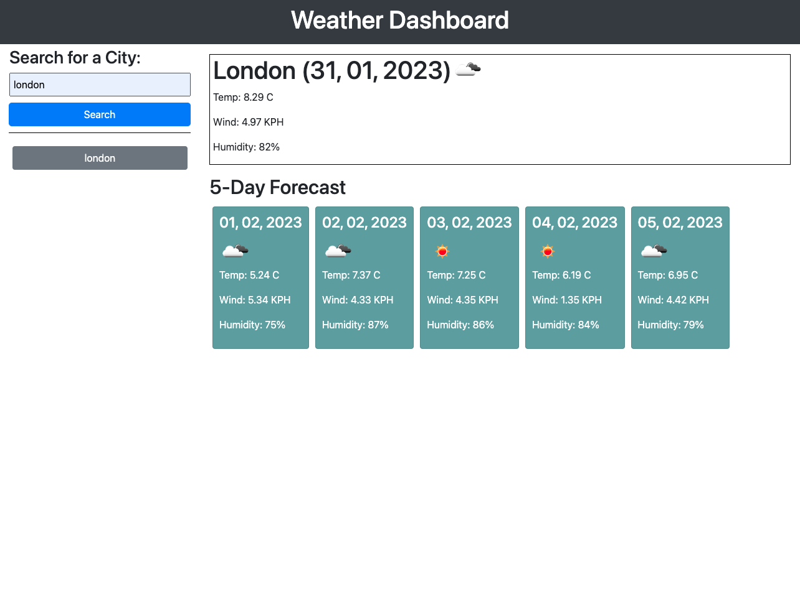
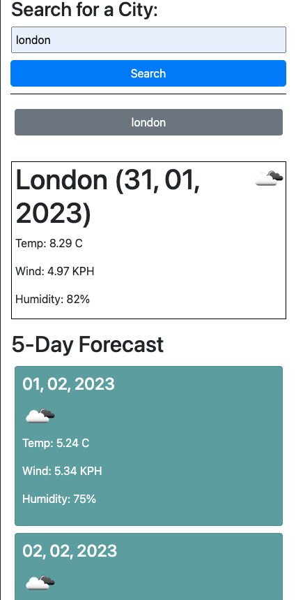

# weather-dashboard-app

## Table of contents

- [Description](#description)
- [Screenshot](#screenshot)
- [Links](#links)
- [Built with](#built-with)
- [Author](#author)

## Description

A Weather Dashboard App that displays the current weather and 5 day forecast for any city the user inputs. This application retrieves data from the OpenWeatherMap API and displays it on the webpage using jQuery and Moment.js.
The application displays the city's name, weather icon, temperature, wind speed, and humidity.

## Screenshot

## Links

[Github](https://github.com/Kevin27j/weather-dashboard-app)

[Live Site](https://kevin27j.github.io/weather-dashboard-app/)

## Built with

- HTML
- CSS
- Bootsrap
- Javascript
- JQuery
- Moment.js
- OpenWeatherMap API

## Author

[Kejvin Pashaj](https://github.com/Kevin27j)
